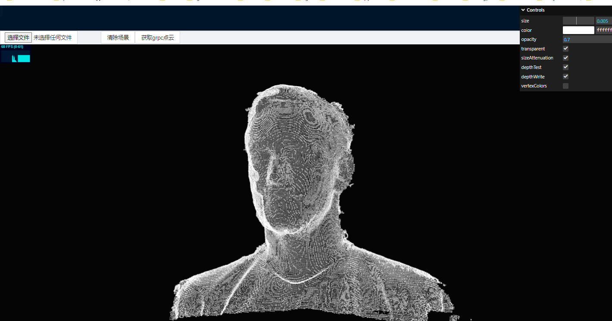

# grpc-web-python-react

这个项目使用 gRPC 实现了 Python 与 React 的通信,并利用 gRPC-Web 来实现点云流渲染。该项目包含三个主要文件夹:`server`、`client` 和 `envoy`。 

[🇬🇧 English](./README.md) | 简体中文

## 克隆项目

```shell
git clone https://github.com/zhengdechang/grpc-web-python-react.git
```

## 服务端

`server` 文件夹包含了使用 proto 文件实现的 Python gRPC 服务。它提供了将点云数据服务给客户端所需的功能。要开始使用服务器,请执行以下步骤:

1. 通过运行以下命令安装所需的依赖项:

```
cd server && chmod +x ./activate && ./activate
```

2. 使用以下命令从 proto 文件生成 gRPC 代码:

```
chmod +x ./generate.sh && ./generate.sh
```

3. 通过运行以下命令启动 gRPC 服务器:

```
python main.py
```

服务器现在应该正在运行,并准备将点云数据提供给客户端。

## Envoy

`envoy` 文件夹包含了 Envoy 的配置文件,Envoy 充当客户端和服务器之间 gRPC 通信的代理。要配置和启动 Envoy,请执行以下步骤:

1. 在 linux 上使用 docker 启动 agent,这里是要执行的命令

```shell
cd envoy && chmod +x ./deploy-linux.sh && ./deploy-linux.sh
```

Envoy 现在将作为代理,将来自客户端的 gRPC-Web 请求转发到 gRPC 服务器。

## 客户端

`client` 文件夹包含了使用 gRPC-Web 渲染从服务器接收的点云数据的 React 应用程序。要设置并运行客户端,请执行以下步骤:

1. 通过导航到 `client` 文件夹并运行以下命令来安装所需的依赖项:

```
cd client && yarn install
```

2. grpc-web 包生成,运行以下命令:

```
yarn generate
```

3. 通过运行以下命令启动 React 开发服务器:

```
yarn start
```

客户端应用程序现在应该正在运行,可以通过 `http://localhost:3000` 访问。它将与服务器建立 gRPC-Web 连接,并渲染收到的点云数据。

## 总结

随着服务器、客户端和 Envoy 的设置和运行,你现在应该有一个功能系统,它使用 gRPC 实现 Python 与 React 的通信。客户端将渲染接收到的点云数据,提供交互式和视觉吸引力的体验。请随意探索和自定义代码以满足您的特定要求。

## 演示

这个项目使用 gRPC 和 gRPC-Web 实现了 Python 与 React 的通信,并用于流式点云渲染。这里有一些截图展示了该项目的功能和界面:

https://grpc-web-python-react.vercel.app/#/threepointcloud2



流式点云渲染界面示例

https://grpc-web-python-react.vercel.app/#/pointcloud

 

点云数据传输示例

请注意,这些截图仅用于演示目的,实际结果可能因您的环境和数据而异。您可以根据您的特定要求和数据自定义和优化该项目。

祝您的项目成功!如果您有任何问题,请随时询问。