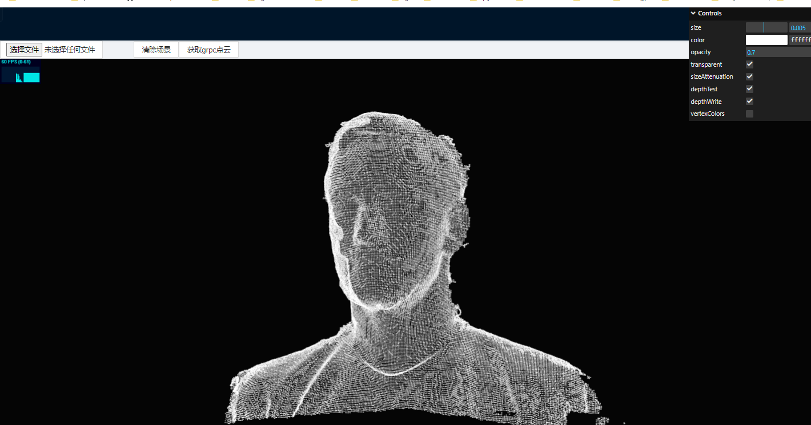
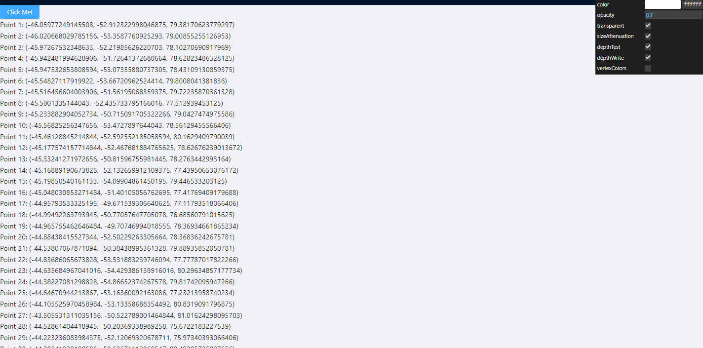

# grpc-web-python-react

This project implements Python communication with React using gRPC, and utilizes gRPC-Web to implement stream point cloud rendering. The project consists of three main folders: `server`, `client`, and `envoy`.

##  Clone project

```shell
git clone https://github.com/zhengdechang/grpc-web-python-react.git
```

🇬🇧 English | [简体中文](./README-EN.md) 

## Server

The `server` folder contains the gRPC service implemented in Python using proto files. It provides the necessary functionality for serving the point cloud data to the client. To get started with the server, follow these steps:

1. Install the required dependencies by running the following command:
   ```
   cd server && chmod +x ./activate && ./activate
   ```

2. Generate the gRPC code from the proto file using the following command:
   ```
   chmod +x ./generate.sh && ./generate.sh
   ```

3. Start the gRPC server by running the following command:
   ```
   python main.py
   ```

The server should now be running and ready to serve point cloud data to the client.

## Envoy

The `envoy` folder contains the configuration files for Envoy, which acts as a proxy for the gRPC communication between the client and server. To configure and start Envoy, follow these steps:

1. To start the agent with docker in linux, here are the commands to execute
   ```shell
    cd envoy && chmod +x ./deploy-linux.sh && ./deploy-linux.sh
   ```

Envoy will now act as a proxy, forwarding gRPC-Web requests from the client to the gRPC server.


## Client

The `client` folder contains the React application that utilizes gRPC-Web to render the point cloud data received from the server. To set up and run the client, follow these steps:

1. Install the required dependencies by navigating to the `client` folder and running the following command:
   ```
   cd cleint && yarn  install
   ```
2. The grpc-web package is generated and running the following command:
   ```
   yarn  generate
   ```
   
3. Start the React development server by running the following command:
   ```
    yarn start
   ```

The client application should now be running and accessible at `http://localhost:3000`. It will establish a gRPC-Web connection with the server and render the received point cloud data.


## Conclusion

With the server, client, and Envoy set up and running, you should have a functional system that enables Python communication with React using gRPC. The client will render the received point cloud data, providing an interactive and visually appealing experience. Feel free to explore and customize the code to suit your specific requirements.

## Demo

This project implements Python communication with React using gRPC and utilizes gRPC-Web for streaming point cloud rendering. Here are some screenshots showcasing the functionality and interface of the project:

https://grpc-web-python-react.vercel.app/#/threepointcloud2

Example of stream point cloud rendering interface

https://grpc-web-python-react.vercel.app/#/pointcloud

Example of point cloud data transmission

Please note that these screenshots are for demonstration purposes only, and the actual results may vary depending on your environment and data. You can customize and optimize the project according to your specific requirements and data.

We wish you success with your project! If you have any questions, feel free to ask.